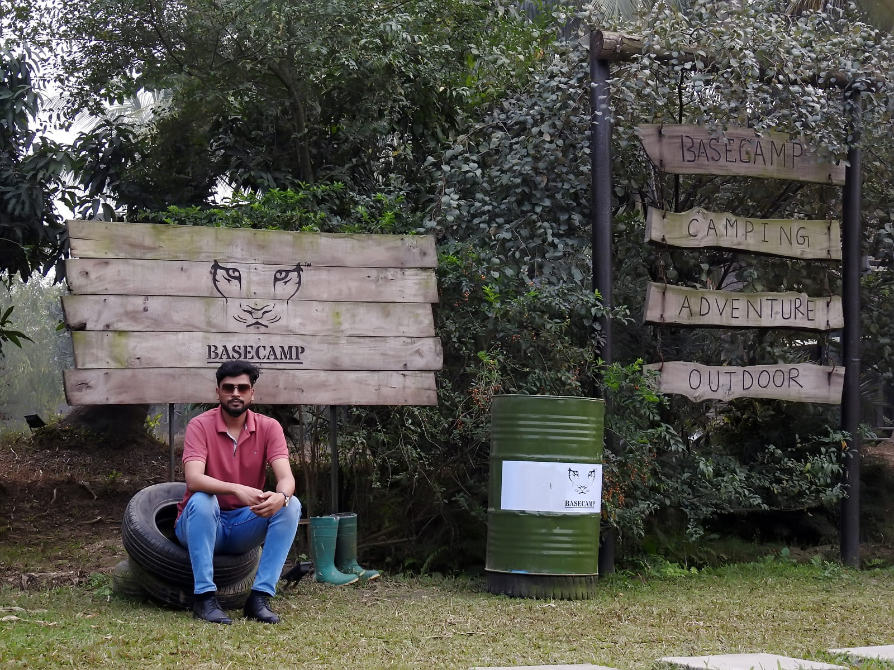

### Hi there 👋 I'm shihab uddin

### About me
---
__As a developer, last 7 years I've specialized in PHP and Laravel, accumulating four years of Laravel experience. I'm well-versed in full-stack development, including Node.js, Vue.js, and React.js. My database expertise extends to MySQL and MongoDB. This background equips me to contribute effectively to diverse web development projects.__

### My Skills
---

- PHP
- JavaScript
- jQuery
- MySQL
- MongoDB
- Laravel
- CakePHP
- Vue js
- Reacl Js
- Angular Js
- Bootstrap
- Html & Css
- Bootstrap
- etc.

### Connect with me
---
[Linkedin](https://www.linkedin.com/in/sihab143/) 

Thanks & Best Regards For Visiting My Profile
